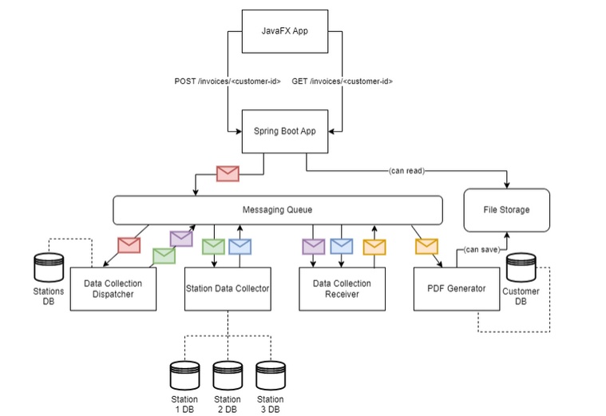
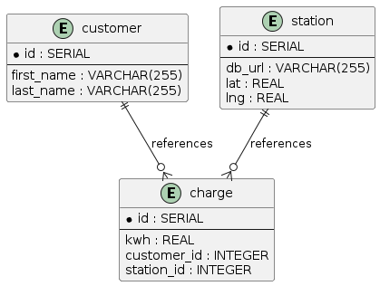

# Distributed Systems Semester Project
This repository contains the semester project for the Distributed Systems course at the University of Applied Sciences FH Technikum Wien from Matthias Huber, David Berger and Gregoire Bartek.
The readme contains all necessary information for setting up the project and running it.

## Responsibilities

- Java FX (Matthias Huber)
- Spring Boot (Matthias Huber)
- Messaging Queue (David Berger)
- PDF Generation (Gregoire Bartek)

## About the project

The Data Station Collector is a project where a distributed system with a REST-based API, a RabbitMQ message queue and a JavaFX UI was implemented.

The workflow:

- Customer can input a customer id into the UI and click “Generate Invoice”


## Architecture



## ER-Diagram



### Relationships


- Customer to Station:
  - This is a one-to-many relationship where one customer can have multiple charges. The charge table references the customer table through the customer_id attribute. Eeach customer can have more charges.
  
- Station to Charge:
  - This is also a one-to-many relationship where one station can be associated with multiple charges. The charge table references the station table through the station_id attribute. A station can have more charges.

## Services

Frontend (Java FX):
- Calling invoice generation to endpoint http://localhost:8080/invoices/ + customerId.
  - The customerId is stored as an String in the frontend. 

Backend Services:
- Customer Database
       - Contains customer data (id, first name, last name)
       - URL: localhost:30001
- Stations Database
	- Contains station data (id, db_url, latitude, longitude)
	- URL: localhost:30002
- Individual Station Databases
	- Contains customer station data (id, kwh, customer_id)
	- URL Station 1: localhost:30011
	- URL Station 2: localhost:30012
	- URL Station 3: localhost:30013


- RabbitMQ-Dashboard / Queue
  - [RabbitMQ-Dashboard](http://localhost:30083)
  - Username: guest
  - Password: guest


- Documentations
- [RabbitMQ](https://www.rabbitmq.com/tutorials/tutorial-one-java.html)


## Requirements
- [Docker](https://docs.docker.com/get-docker/)
- IntelliJ IDEA

## Start
```shell
docker-compose up of the database image
```

## RabbitMQ-Dashboard
- [RabbitMQ-Dashboard](http://localhost:30083)
- Username: guest
- Password: guest


## Documentations
- [RabbitMQ](https://www.rabbitmq.com/tutorials/tutorial-one-java.html)
	

## Requirements
- [Docker](https://docs.docker.com/get-docker/)

## User Guide

Start the databases with the following command in the databases folder:
```shell
docker-compose up
```
After that, start each sub component (DataCollectionDispatcher, DataCollectionService, InvoiceService, Frontend, PDFGenerator, SpringBootApp and StationDataCollector) with opening the project in IntelliJ IDEA and running the main class of each component.
We were folowing the following order:
1. DataCollectionDispatcher
2. DataCollectionReceiver
3. StationDataCollector
4. SpringBootApp
5. PDFGenerator
6. JavaFX

# Generating PDF

1. Once the applications have started, open the GUI for the desired application.
2. Enter the number of customers for whom you want to generate an invoice (1-3).
3. Wait for the PDF to be generated. The progress will be displayed in the application.
4. After the PDF is generated, click the "View" button to open the PDF file. The pdf is saved in the following project path : files/invoice/{customerId}.pdf

If you encounter any issues or have specific questions about the project, refer to the project documentation or consult the project's support resources.
Feel free to contact Matthias Huber (wi22b112@technikum-wien.at) per E-Mail.

For latest updates and news, visit the Github repo at [https://github.com/huhubi/DISYS_project]()


# Lessons Learned

We encouncered a problem in our DataCollectionDispatcher where we quite dont know how to fix it.
Although we tried totroubleshoot it with a lot of ressources, we were not able to.
So we decided to mock the pdf generator and also implement an offline functionality in the frontend. Which first checks if there is a file saved locally and if not, it will call the Spring Boot application to use the process in the architecture mentioned above.
For offline functionality you still need to start the docker containers to get the data from the databases.

# Unit testing decisions

We tried to implement unit tests for the core use cases and edge cases.
About 3 unit tests were implemented for each compononent.

# Effort

We would estimate that it took about 20 hours per person to implement according to the requirements - about 60 hours in total.


